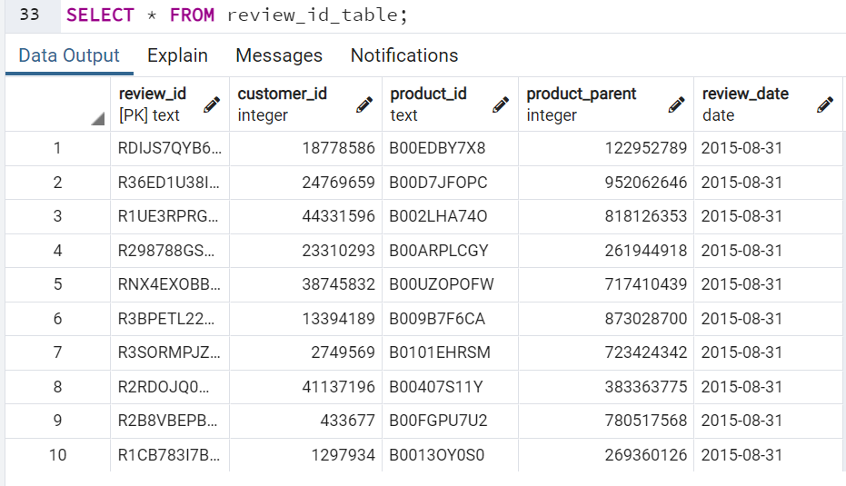

# Amazon_Vine_Analysis

### **Objectives**

The objective of the project is help _Big Market_, a startup company that help businesses optimize their marketing effort. One of the Big Market's client, _Sellby_ is about to release a large catalog of products in a leading retail website. They want to know how the review of their products compare to the review of similar products sold by competition. _Sellby_ is paying a small fee to Amazon and provide free products to _Amazon Vine_ members to write a product review. Sellby wants to know if such a program is cost effective. Amazon Vine members are a select group of customers who receive free products in exchange for their evaluation. The products are provided by the vendors. The Amazon Vine members post their opinion about the new and pre-released items to help fellow customers make educated purchasing decisions. Our task in the project is to analyze the Amazon reviews.

### **Analysis**

 We are given access to approximately 50 datasets, each containing customer data and reviews of a specific product, from clothing apparel to wireless products. For _**Deliverable 1**_, we picked one of the datasets and used PySpark to perform ETL (Extract, Transform and Load) process to extract the dataset, transform it and connect to an Amazon AWS RDS instance. We loaded the data into pgAdmin and created four tables of data. For _**Deliverable 2**_, I used Pandas to determine if there is any bias toward favorable reviews from the Vine members in the dataset. I chose the dataset that contained the reviews written about Toys.

 #### **Deliverable 1: Perform ETL on Amazon Product Reviews**

 We are given access to a dataset from <a href = "https://s3.amazonaws.com/amazon-reviews-pds/tsv/index.txt">Amazon Review datasets </a> website. Each dataset contained same fifteen column information (See Fig 1 for column names). I chose the dataset containing information about toys from the reviews dataset link. The steps are the following:

 - Create a new database with Amazon RDS and choose PostgreSQL engine. We used "Free tier" templates, removed any automated update or backup options so that we will not be paying for services we do not require for this project. We made the dataset accessible to the public so that we can access it from any device. The database is protected by the master password.

 - **Extract:** I uploaded the starter code provided to us, *Amazon_Reviews_ETL.ipynb* to Google Colab Notebook. I used PySpark to download the Vine reviews on toys. The dataset is converted in to a dataFrame (Fig 1).

 
 

 **Fig. 1:** The figure shows the dataset containing Vine reviews of toys converted into a DataFrame in Google Colab using PySpark.

- **Transform:** The dataFrame is transformed into four smaller DataFrames using PySpark. These DataFrame columns match the schema of four tables created separately in pgAdmin using SQL. The table names are *customer_table*, *products_table*, *review_id_table* and *vine_table*. Figure 2 shows the four dataFrames in PySpark.

**Fig. 2:** The figures show four DataFrames created by extracting certain columns from the original dataset obtained from Amazon Vine website. 

- **Load:** The DataFrame is loaded into pgAdmin by making connection to the AWS RDS instance created earlier. The DataFrames had a large amount of data and it took several minutes to upload the data to pfAdmin. The loaded tables are shown in Fig 3 below.

**Fig. 3:** The figures show four tables created from _Loading_ the data to pgAdmin from the DataFrames created by PySpark in Google Colab.

### **Deliverable 2: Determine Bias of Vine Reviews**

The objectives of this portion of the analysis is to determine if there is any bias in the reviews that were written as a part of the Vine program. We had the options to choose from PySpark, Pandas or SQL to perform this task. I chose Pandas using Jupyter Notebook. The steps taken in Pandas are the following, accompanied by the figures showing the DataFrames and the results:

- Export the *vine_table* as a csv file. Read the csv file in Pandas and change it to a DataFrame. (Fig 4.)

**Fig 4:** The image shows vine_df DataFrame in Pandas.

- The data is filtered so that the *total_votes* count is equal to or greater than 20. These reviews are likely helpful and not only does this ensure there are no "division by zero" errors, a minimum sample size of 20 makes the analysis statistically meaningful.  The result is shown in  *vine_20_df* DataFrame (Fig 5).

**Fig 5:** Image of the dataframe showing more than 20 votes.

- Filter the *vine_20_df* to retrieve the rows with *helpful_votes* divided by *total_votes* is equal to or greater than 50%. (Fig 6)

**Fig 6:** The image showing the DataFrame that is filtered by the helpful_votes/total_votes is equal to or greater than 50%.

- Filter the DataFrame created above to create a new DataFrame, *vine_paid_df* that retrieves all the reviews written for the Vine program (paid). (Fig 7) 

 
 **Fig 7:** The image shows the DataFrame filtered by paid Vine members product ratings.

 - Repeat the filtering process as above, but the filter it based on the reviews written by customers not in the Vine program (unpaid). (Fig 8)

 

 **Fig 8:** The image shows the DataFrame filtered by unpaid customer product ratings.

 - I determined the (i) total number of reviews, (ii) the number of 5-star reviews. (Fig 9)

 

 

 **Fig 9:** The images show the total number of reviews and the number of 5 star reviews. This includes 5 star reviews by paid and unpaid members.

 - Finally, I determined the percent of five star reviews made by (i) paid and (ii) unpaid members. (Fig 10)

 
 

 **Fig 10:** The image shows the percent of five star reviews given by customers who were (i) paid  and (ii) unpaid. The data shows that the majority of 5 star reviews were given by the non Vine customers. 

 #### **Further Analysis:**

 I wanted to plot a histogram of the star review counts of the paid Vine members and compared with the star review counts of the unpaid Vine members. I normalized the counts and made a bar plot instead. The plots are shown in Fig 11 and Fig 12.

 

 **Fig 11:** The image shows a bar plot of normalized counts of star reviews made by **paid Vine members**.

 

 **Fig 12:**  The image shows a bar plot of normalized counts of star reviews made by **unpaid Vine customers**.

 #### **Intrinsic Bias:**
 The results shown thus far indicate that vine members are more reserved in providing a poor review, and more reserved in giving a 5-star review. This finding is sufficient to make conclusions for the question being asked: Whether to use vine members for an initial review during a new product launch on Amazon. However, it is possible that products that did not receive initial vine reviews have more negative non-vine reviews simply because those products are inferior. To determine this intrinsic bias, all I would need to do, is filter on all toys that had more than 20 vine reviews, and more than 20 non-vine reviews. Then, the subset of toys being analyzed would serve as a control. If it is seen that the percent of poor reviews by non-vine members goes down compared to what was found above, this would suggest that distributors of inferior products would not be inclined to use vine reviewers.

 ### **Discussion and Conclusion**

 The goal of the Amazon Vine Analysis project is to analyze whether a review made by a paid Vine member would more likely be biased towards a five star ratings. The Vine toys database contained 9,231,159 rows of total reviews. Out of those the products 5,716,852 products got five star ratings which corresponds to 61.93%. After dropping products getting less than 20 reviews and extracting the reviews with a ratio of "helpful_votes/total_votes" equal to or greater than 50%, I found the following:

 - **Five star rating conundrum -** The number of 5 star ratings given by paid Vine members is much smaller than the number of 5 star ratings given by unpaid (standard) customers. The percent of 5 star ratings given by Vine paid members is 0.31%, while the percent of 5 star ratings given by unpaid customers is 99.69%. It seems odd at a first glance. However, there are more unpaid people buying the products and writing reviews than the paid Vine members. Therefore, this result is expected, and shows that the counts must be normalized. 

 - **Comparing all star ratings -** I wanted to see how all the star ratings compare within the Vine paid members. The data in the plot is normalized so that the comparison is meaningful. As seen in Fig 11, the paid members ratings are mostly 3 or higher. This makes sense since a paid member will more likely going to be restrained in his/her opinion for the fear of losing the perk of receiving free products and getting paid for giving too many low star ratings. About 70% of the ratings in 3 or higher. By comparison, all the star ratings given by unpaid customers shows that the ratings are distributed from 1 to 5. The data in this plot is also normalized to make the comparison meaningful. While 50% of the customers gave 5 start ratings, the rest of the ratings are between 1 through 4. In my opinion, the star ratings given by unpaid customers are more likely going to be honest ratings. It should be noted that people usually are more inclined to write a bad review than a good review because a poor product experience invokes stronger negative emotion.

 - **Advice to Sellby -** It seems that Sellby would more likely get honest product reviews from standard customers than from the paid Vine members program. However, when a product is placed in the market, prospective buyers rely on the reviews posted by other customers who used the same product before. This is more relevant to online products since the first impression is important so that a customer would order the product. It will be good to see product reviews at the initial launching of a product. However, Sellby does not need to continue to supply the same free products to Vine members once the product is established by reviews. As Sellby is planning to keep on launching new products, it would be worth while supplying free products to the Vine membership program.
